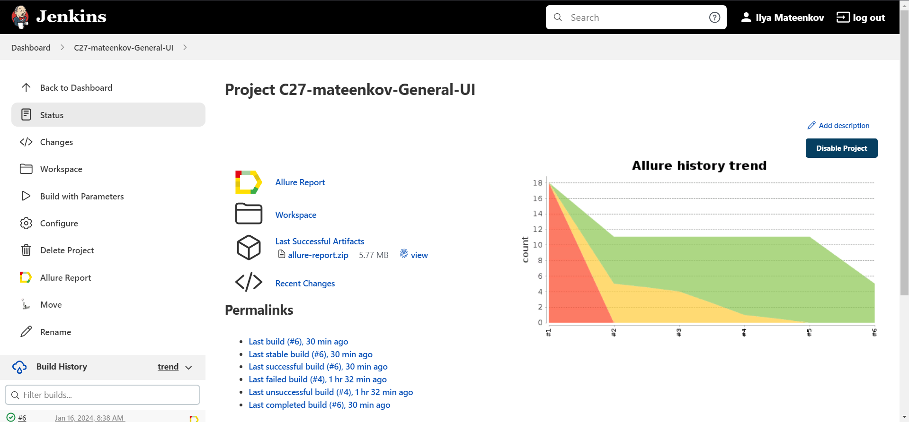
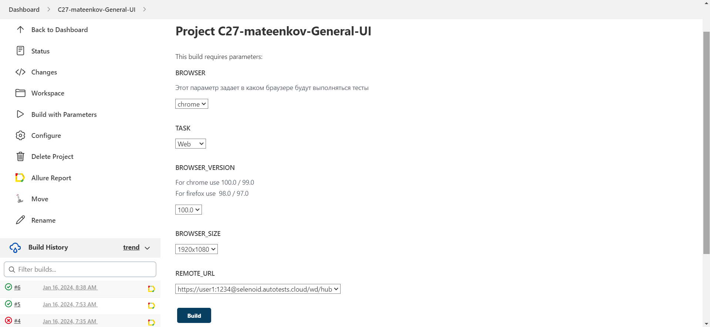
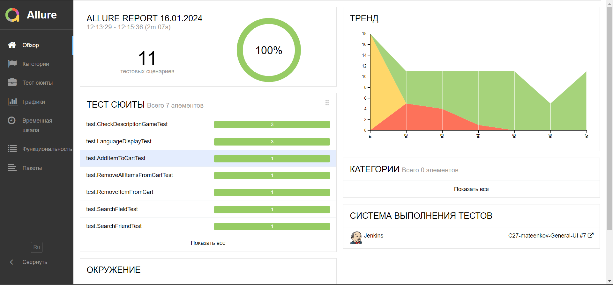
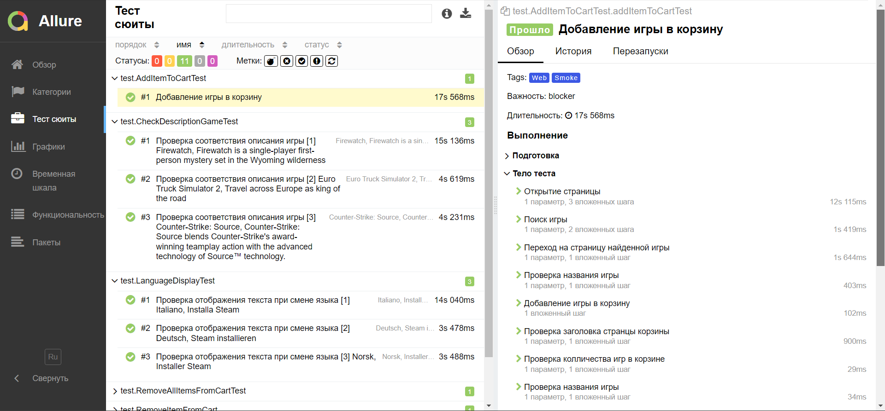
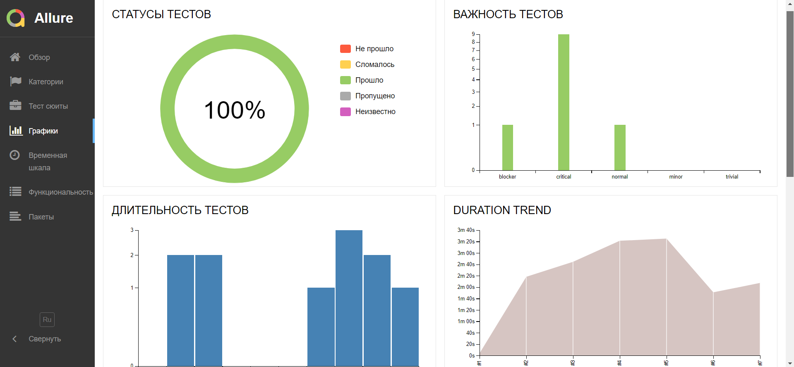
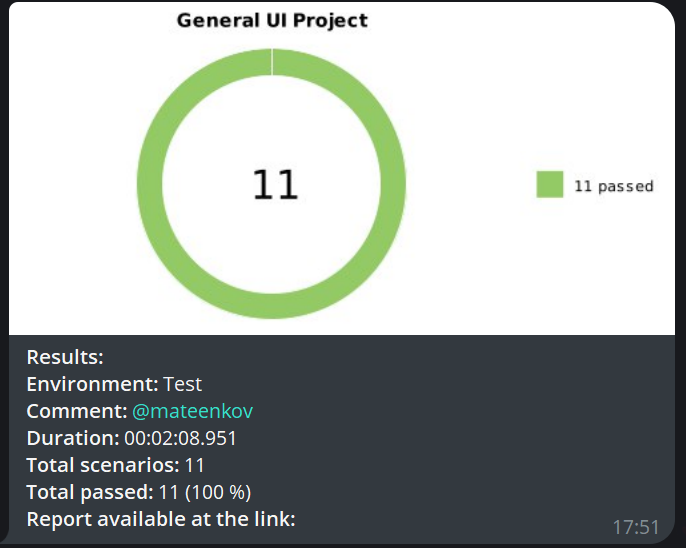

# Проект по UI автоматизации тестирования магазина компьютерных игры [STEAM](https://store.steampowered.com/) 


## 📝 Описание проекта 
Данный проект является дипломной работай курса по автоматизационному тестированию от [QA_Guru](https://qa.guru/?utm_source=yandex&utm_medium=cpc&utm_campaign=Search%2FBrand&utm_content=type1.1.premium.13541539116.desktop...none.search.Смоленск&utm_term=qa%20guru&yclid=11201726552105025535). 
Данный проект реализован под локальное и удаленное развертывание и запуск авто-тестов. 

Проект находиться в открытом доступе и его  можно использовать в качестве шаблона для ваших целей, кастомизации и т.п.

Ваш лайк в качестве звездочки ⭐️ поставленной этому проекту - одобряется и ни как не запрещается ) 


##  ✏️ Список автоматизированных тест-кейсов:
- [x] _Добавление игры в  корзину_
- [x] _Удаление игры из корзины_ 
- [x] _Удаление нескольких игр из корзины_
- [x] _Проверка соответствия описания игры_  
- [x] _Проверка работы поиковой выдачи _**Steam**__
- [x] _Проверка отображения текста при смене языка_ 
- [x] _Поиск друзей в _**Steam**_ во вкладке **Community**_


## 🧰 Используемые технологии и инструменты:
| Java                                                                                                      | IntelliJ Idea                                                                                                                 | GitHub                                                                                                     | JUnit 5                                                                                                           | Gradle                                                                                                     | Selenide                                                                                                         | Selenoid                                                                                                                  |  Jenkins                                                                                                           |
|:----------------------------------------------------------------------------------------------------------|-------------------------------------------------------------------------------------------------------------------------------|------------------------------------------------------------------------------------------------------------|-------------------------------------------------------------------------------------------------------------------|------------------------------------------------------------------------------------------------------------|------------------------------------------------------------------------------------------------------------------|---------------------------------------------------------------------------------------------------------------------------|-------------------------------------------------------------------------------------------------------------------:|
| <a href="https://www.java.com/"></a>  | <a id ="tech" href="https://www.jetbrains.com/idea/"></a> | <a href="https://github.com/"></a> | <a href="https://junit.org/junit5/"></a> | <a href="https://gradle.org/"></a> | <a href="https://selenide.org/"></a> | <a href="https://aerokube.com/selenoid/"></a> |   <a href="https://www.jenkins.io/"></a> |


| Allure                                                                                                                     |
|----------------------------------------------------------------------------------------------------------------------------|
| <a href="https://github.com/allure-framework"></a> |


###  💻 Выполнить запуск автотестов из терминала можно командой:  

`gradle clean test`

### Удаленный запуск тестов:

```bash
gradle clean test

-Dbrowser=${browser}
-DbrowserVersion=${browserVersion}
-DbrowserSize=${browserSize}
-DremoteUrl=${remoteUrl}
-DremoteUrl=${TASK}
```

### Параметры запуска тестов:
```browser``` - браузер в котором будут выполняться авто-тесты (по умолчанию ```chrome```)

```browserSize``` - размер окна браузера (по умолчанию - ```1920x1080```)

```browserVersion``` - версия браузера (по умолчанию ```100.0```)

```remoteUrl``` - адрес удаленного сервера, где будут запускаться авто-тесты

```task``` - отдельные группы авто-тестов которые нужно запустить

### Запуск авто-тестов в [Jenkins](https://jenkins.autotests.cloud/job/C27-mateenkov-General-UI/)
**Главная страница проекта:**


Для запуска сборки необходимо указать значения параметров и нажать кнопку ```Build with Parameters```

**Страница настройки параметров:**


После натсройи парамметров, запустить сборку можно по кнопке ```Build```

Результаты сборки можно посмотреть в Allure отчёте, кликнув на значок  ```Allure Report```.

### Отчет о результатах проведенных авто-тестов в [Allure Report](https://jenkins.autotests.cloud/job/C27-mateenkov-General-UI/7/allure/)

**Главная страница Allure Report:**


**Авто-тесты с шагами воспроизведения:**


**Графики с результатами тестирования:**


### Отчет о выполнении тестов в Telegram с использованием бота:
**Оповещения о результатах сборки проекта:**



### Пример запуска авто-теста в Selenoid

В конце каждого авто-теста выполняется скриншот и запись экрана, и прикрепляется к каждому тесту в Allure  отчете 

Запись экрана авто-теста - ```Добавление игры в корзину``` 

